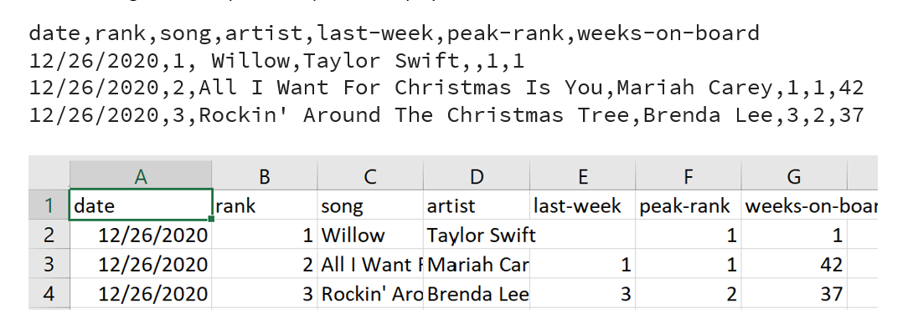

# Billboard-Hot-100
 
A C++ program that analyzes data for the top 50 songs from weekly Billboard Hot 100 charts spanning 1960–2020. The dataset is seperated into three comma-separated values (csv) files by time period: 1960–1980, 1981–2000, and 2001–2020. The data is sorted from newest to oldest, and then by rank. The following is an example of sample data displayed in .csv and Excel:

The user can choose which file to analyze. Once the data is read from the file, the following menu options for analysis will be displayed:
- **Menu Option 1** – Display the following general information about the dataset that has been read in:
    - The number of rows (aka size) of the dataset, and
    - The number of unique songs represented in the dataset
- **Menu Option 2** - Display the Billboard info of the song with the most #1 occurrences for a given decade or year. If there is a tie, all songs within the tie will be printed.
- **Menu Option 3** - Display the Billboard info for the most long-lasting (highest number of weeks) song on the charts for a given decade or year. Only 1 song is displayed.
- **Menu Option 4** - Display the Billboard info for the song with the greatest weekly climb on the charts given a decade or year. This is determined by comparing the rank of the song previously to what it is currently. If there is a tie, all songs within the tie will be printed.
- **Menu Option 5** - Display the Billboard info for records that match the user input for artist search. The program prompts the user to enter a search term and finds all records with an artist’s name that contains that search term. E.g., a search for "beyonce" would discover songs where Beyoncé was the main artist, or even the feature artist. The first 10 songs that were #1 on the charts and that match the artist’s name will be displayed.
- **Menu Option 6** - Exit the program. 
